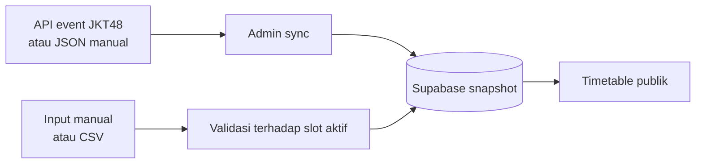

<p align="center">
  
</p>

<h1 align="center">Ayo Senyumlah</h1>

<p align="center">
  Timetable komunitas untuk melihat siapa yang hadir di sesi 2-Shot dan Meet & Greet JKT48/AKB48.
</p>

<p align="center">
  <a href="https://ayo-senyumlah-srs.vercel.app">Buka aplikasi</a>
  ·
  <a href="https://github.com/SergioWinn/AyoSenyumlahSRS/issues">Laporkan masalah</a>
</p>

## Tentang proyek

Ayo Senyumlah membantu teman-teman dalam komunitas menyusun jadwal event dan menemukan barengan pada sesi yang sama. Jadwal JKT48 dan AKB48 ditampilkan dalam satu timetable, dengan filter berdasarkan tipe tiket, sesi, member, dan nama teman.

Data sesi disimpan sebagai snapshot di Supabase. Pengunjung membaca snapshot tersebut tanpa memanggil API JKT48 secara langsung; pembaruan sumber hanya dilakukan oleh admin atau melalui impor JSON manual.

> Proyek fan-made dan tidak berafiliasi dengan JKT48, AKB48, atau pihak penyelenggara event.

## Fitur

- Satu timetable untuk 2-Shot dan Meet & Greet JKT48/AKB48.
- Filter sesi, member, teman, dan jadwal yang sudah memiliki peserta.
- Input jadwal secara manual atau melalui CSV JKT48 Schedule Recap.
- Pencarian member dengan nama lengkap maupun nickname.
- Foto member JKT48 dan AKB48 dengan fallback inisial.
- Auto-refresh data publik setiap 20 detik saat halaman aktif.
- Light mode, dark mode, dan tampilan responsif.
- Admin CRUD untuk jadwal peserta.
- Sinkronisasi API JKT48, cookie Waiting Room opsional, serta impor snapshot JSON.
- Snapshot lama dipertahankan saat sumber gagal atau sudah tidak tersedia.

## Alur data



## Teknologi

- [Next.js](https://nextjs.org/) 16 dan React 19
- [Supabase](https://supabase.com/) untuk PostgreSQL dan autentikasi admin
- [Vercel](https://vercel.com/) untuk deployment
- Node.js 22+
- Node test runner dan Playwright untuk verifikasi

## Menjalankan secara lokal

### Prasyarat

- Node.js 22 atau lebih baru
- Proyek Supabase yang sudah memiliki schema aplikasi
- Satu akun Supabase Auth yang terdaftar di tabel `admin_users`

Schema yang digunakan aplikasi mencakup tabel `events`, `event_sources`, `session_slots`, `schedules`, dan `admin_users`, serta fungsi PostgreSQL `sync_event_source` untuk mengganti snapshot secara atomik.

### Instalasi

```bash
git clone https://github.com/SergioWinn/AyoSenyumlahSRS.git
cd AyoSenyumlahSRS
npm install
```

Salin `.env.example` menjadi `.env.local`, lalu isi nilainya:

```env
NEXT_PUBLIC_SUPABASE_URL=https://PROJECT_REF.supabase.co
NEXT_PUBLIC_SUPABASE_PUBLISHABLE_KEY=sb_publishable_xxx
SUPABASE_SECRET_KEY=sb_secret_xxx
JKT48_COOKIE=
```

`JKT48_COOKIE` bersifat opsional. Cookie Waiting Room juga dapat diberikan sementara melalui halaman admin dan tidak akan disimpan.

Jalankan development server:

```bash
npm run dev
```

Buka [http://localhost:3000](http://localhost:3000). Halaman admin tersedia di `/admin` dan memang tidak ditautkan dari halaman publik.

## Menyiapkan event

1. Pastikan hanya satu baris pada `events` yang memiliki `is_active = true`.
2. Tambahkan sumber JKT48/AKB48 pada `event_sources` dengan kombinasi event, grup, dan tipe tiket yang unik.
3. Masuk ke `/admin` menggunakan akun Supabase Auth yang terdaftar di `admin_users`.
4. Sinkronkan setiap sumber, atau impor respons JSON endpoint `/bonus` secara manual jika API merespons `403`.
5. Periksa snapshot sebelum membagikan aplikasi.

Sesi AKB48 tetap memakai jalur dan sesi yang tersinkron dengan timetable event. Katalog member AKB48 hanya digunakan untuk pencocokan nama, nickname, dan foto.

## Impor CSV

CSV harus diekspor melalui ekstensi [JKT48 Schedule Recap](https://chromewebstore.google.com/detail/jkt48-schedule-recap/amkifnihmncpgmnjaojdmcohmnpalbki). Aplikasi hanya mengambil tiket pada tanggal event aktif, lalu mencocokkan member, sesi, dan tipe tiket dengan snapshot.

Jalur tidak wajib diisi karena mengikuti slot aktif. Format lama yang masih memiliki kolom jalur tetap didukung.

## Script

| Perintah | Fungsi |
| --- | --- |
| `npm run dev` | Menjalankan development server |
| `npm run build` | Membuat production build |
| `npm start` | Menjalankan production server lokal |
| `npm test` | Menjalankan unit test |
| `node tests/visual.mjs` | Menjalankan pemeriksaan visual dengan Chrome lokal |

## Deploy ke Vercel

1. Impor repository ini ke Vercel.
2. Tambahkan seluruh environment variable dari `.env.example`.
3. Gunakan pengaturan build default Next.js.
4. Setelah deployment selesai, buka `/admin` dan sinkronkan snapshot event.

Jangan pernah mengekspos `SUPABASE_SECRET_KEY` dengan prefix `NEXT_PUBLIC_`. Secret key hanya digunakan oleh route server.

## Kontribusi

Laporan bug dan usulan perbaikan dapat dikirim melalui [GitHub Issues](https://github.com/SergioWinn/AyoSenyumlahSRS/issues). Sertakan langkah reproduksi dan screenshot bila masalah berkaitan dengan tampilan.

## Kredit

Dikembangkan oleh [@estrellawin19](https://x.com/estrellawin19). Dukungan proyek tersedia melalui [Tako](https://tako.id/Sportagame19Win).
